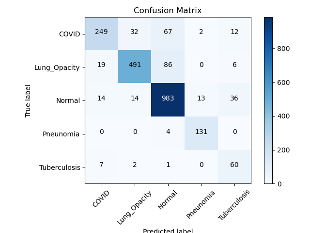

# Chest XRay Classification
## Motivation
The primary objective of this project is to develop convolutional neural networks (CNNs) specifically tailored for a crucial classification task involving Chest X-ray images of patients. The aim is to efficiently categorize these images into five distinct types: COVID-19, Lung Opacity, Tuberculosis, Pneumonia, and Normal. By leveraging the power of deep learning and CNNs, the project seeks to enhance the accuracy and speed of diagnosis, ultimately contributing to more effective and timely medical interventions. Through this cutting-edge technology, healthcare professionals can benefit from improved decision-making and patient care, particularly in the context of respiratory-related illnesses and infections.

## Dataset
* The Shenzhen dataset consists of 662 frontal CXR images, in which 326 images are classified as normal and 336 images are classified as manifestation of tuberculosis.
* The Montgomery dataset contains 138 frontal chest X-rays, of which 80 images are classified as normal cases and 58 images are with manifestations of tuberculosis.
* The Belarus dataset is made of 304 CXR images of patients with confirmed TB.
* Covid-19 Chest X-Ray Database consists of 3616 COVID-19 positive cases, 10,192 normal, 6012 Lung Opacity (Non-COVID lung infection) and 1345 Viral Pneumonia images.

### From the above 4 public datasets, I merged and populated a dataset consisting of `22,269` images and then split them into `training`/`validation`/`testing` set with ratio `80% - 10% - 10%.`


| Type          | COVID-19 | Lung Opacity | Normal | Pneunomia | Tuberculosis | Total |
| :-            | :-:      | :-:          | :-:    | :-:       | :-:          | :-:   | 
| Train         | 2,892    | 4,809        | 8,478  | 1,076     | 558          | 17,813|
| Validation    | 362      | 601          | 1,060  | 134       | 70           | 2,227 |
| Test          | 362      | 602          | 1,060  | 135       | 70           | 2,229 |
| Total         | 3,616    | 6,012        | 10,598 | 1,345     | 698          | 22,269|

## Data Analysis
I lack the expertise in medical field to provide deeper analysis of the data, and I believe I shouldn't fabricate information just to meet the project's requirements.

## Data Visualization
Check `EDA.ipynb` notebook.


## Solution Overview
I use ResNet50 as my backbone to solve this classification problem.

## Metrics
The primary measure for this issue is **accuracy**, specifically because it involves a **multiclass classification problem**.

## Libraries used
The following python libraries were used in this project. This is also included in the `requirements.txt`.
```
Flask==2.3.2
matplotlib==3.7.2
numpy==1.25.1
orjson==3.9.2
Pillow==10.0.0
randaugment==1.0.2
scikit_learn==1.3.0
timm==0.9.2
torch==2.0.1
torchvision==0.15.2
tqdm==4.65.0
```

## File Description
**app.py**: Flask app.
**EDA.ipynb**: Notebook containing the data analysis.
**train.py**: Training script.
**test.py**: test inference script.
**config**: consists of training config.
**src**: utils function.

## Installation
```
git clone https://github.com/quangdungluong/data-scientist-udacity
cd ./data-scientist-udacity/Data-Scientist-Capstone
pip install -r requirements.txt
```

## Training
```
python train.py -D path_to_data_directory \
                -M path_to_model
```

## Test
```
python test.py -D path_to_data_directory \
                -M path_to_model
```
## Demo
```
python app.py
```

## Accuracy on Testset
| ResNet50 |
|---|
| 85.87% |

## Confustion Matrix


## Improvement
This is only a pet project and I don't spend too much time on it, so you can improve the model performance by using more data augmentation, large models (such as EfficientNet, ViT,...), and training for more epochs.

## Acknowledgements
- https://lhncbc.nlm.nih.gov/LHC-downloads/dataset.html
- https://data.lhncbc.nlm.nih.gov/public/Tuberculosis-Chest-X-ray-Datasets/Montgomery-County-CXR-Set/MontgomerySet/index.html